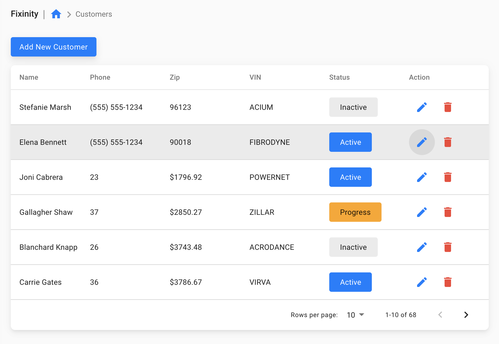
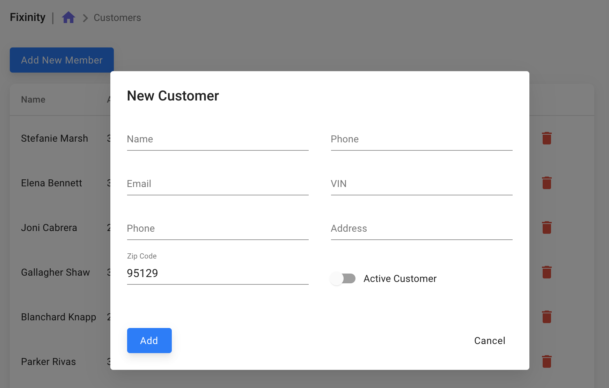
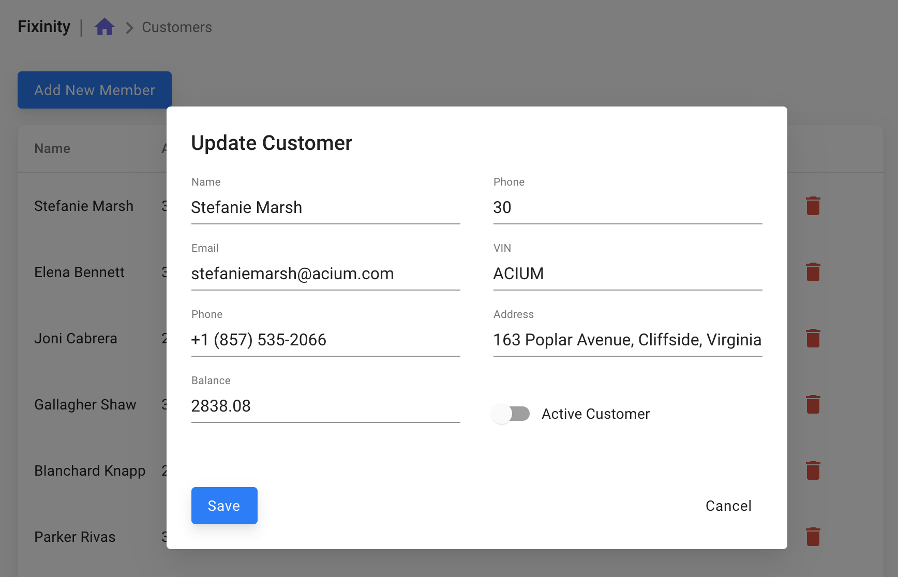
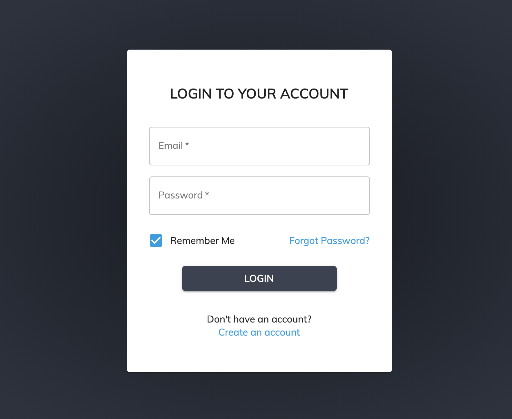

# Fixinity CRUD Application

Create a CRUD Application with an user authentication

# Information

This project is only front end part and you can hand code json api results.
Feel free to use any kind of frameworks(Bootstrap, Foundation, etc) including LESS, SASS 
 

## Steps / Technologies:
* Setup a react project with babel, webpack etc.(React starter kit)
* HTML/CSS
* React Components
* Add Redux(Decide which data you want to store in Redux)
* Rest API (GET, POST, DELETE)

## List of features

* UI 
    * Build an UI as it's shown in the picture
* Add/Remove/Delete
    * User should able to add/remove/delete any customer
* Pagination
    * User should able to see given number of rows in a page with next/previous buttons.
* Sort
    * User should able to sort based on all rows
* Search
    * We don't have an UX yet, so discuss and come up with a solution. User should able to search by name, phone, zip or VIN number
* Filter
    * We don't have an UX yet, so discuss and come up with a solution.
    User should able to filter by multiple zip codes and status
* Login/Logout
    * User should see only if logged in and store data in cookie or local storage.
### Helpers

const users = [
  {id:1, name:'Stefanie', lastName:'Marsh', phone:'5555551234', zip:'96123', vin:'123123123', status:'inactive'},
  {id:2, name:'Elena', lastName:'Bennett', phone:'5555512234', zip:'96123', vin:'123123123', status:'active'}
]

### Deployment

After finishing the project you can upload to a github with commits (Required) and publish heroku if possible (Optional) 

## UI

