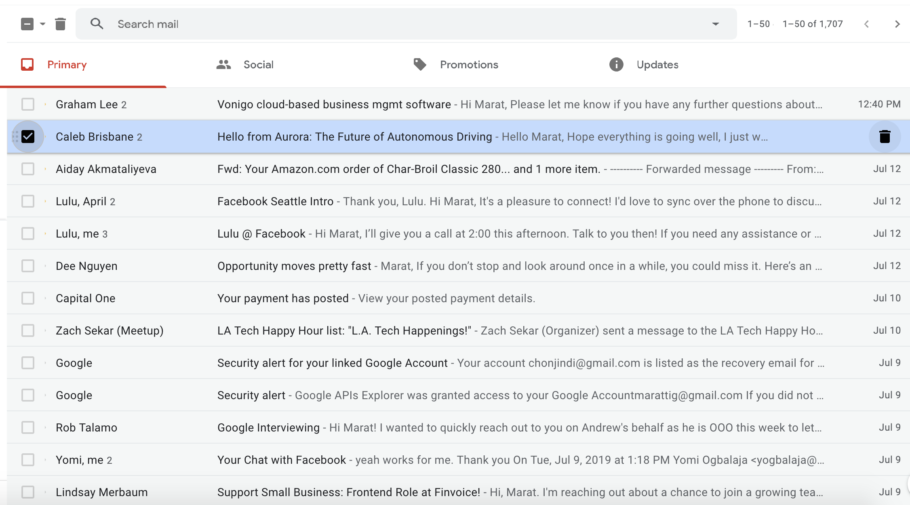

# Simple Gmail

Create simple version of gmail with features below.

# Information

This project is only front end part and you can hand code json api results.
Feel free to use any kind of frameworks(Bootstrap, Foundation, etc) including LESS, SASS 
 We are looking these skills:
* Maintainable coding
* Using components
* Project structure
* Redux (Optional)
* Organized

## List of features

* Search
    * User should able to search list of emails based on content and/or title.
* Pagination
    * User should able to see 50 emails in a page with next/previous buttons.
* Tabs
    * Page has 4 tabs which all work similar. Implement just first tab and other tabs can be empty.
* Delete
    * User should able to delete emails individually by "Delete" button or selected emails on current page by using global select "Delete" button.

### Tech

* React (Redux, React-Router)

### Deployment

After finishing the project upload to github with commits (Required) and publish heroku if possible (Optional) 

## UI

