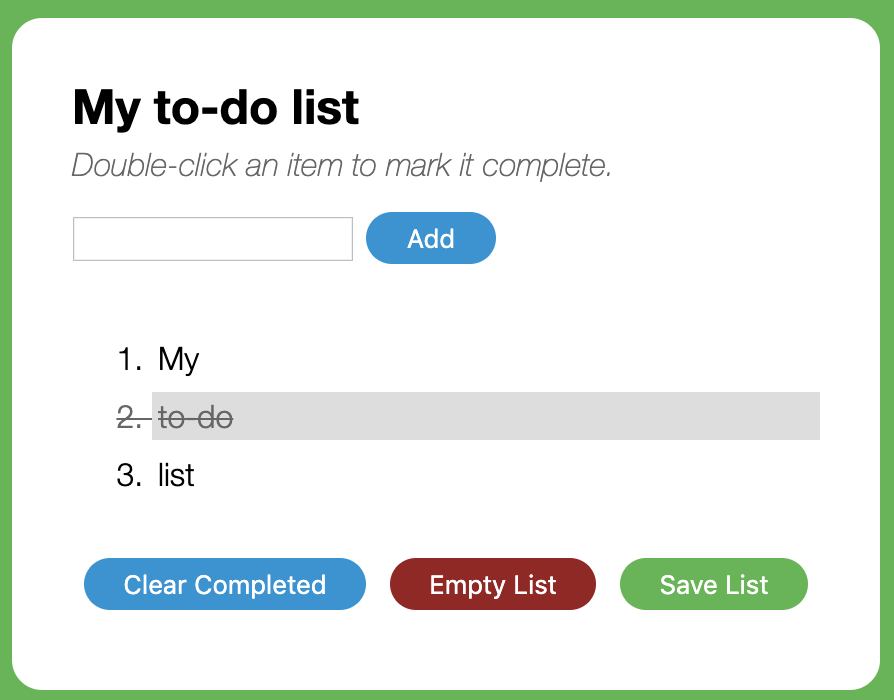

# Todo

Create a todo application

## What you learn
* Creating your own JavaScript functions
* Listening for different user actions on a web page
* Using functions together to write code more professionally
* Saving user information between visits to your web page

## List of features

* Add todo items
* Complete todo items
* Clear todo items
* Empty items
* Save list
* Load list
    * When user refreshes the page, previous list suppose to be there.

### Tech

* HTML,CSS,JS

### Deployment

Github 

## UI

